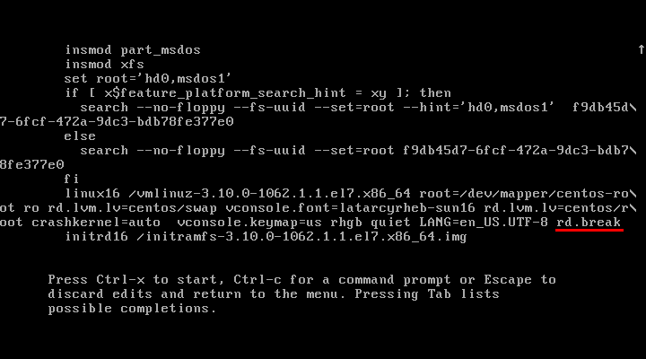
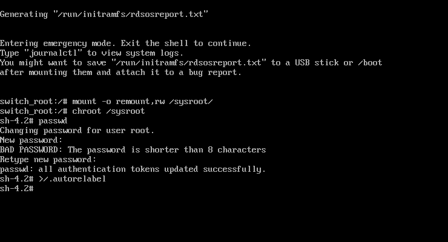
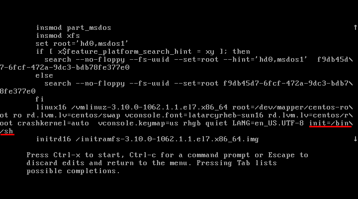
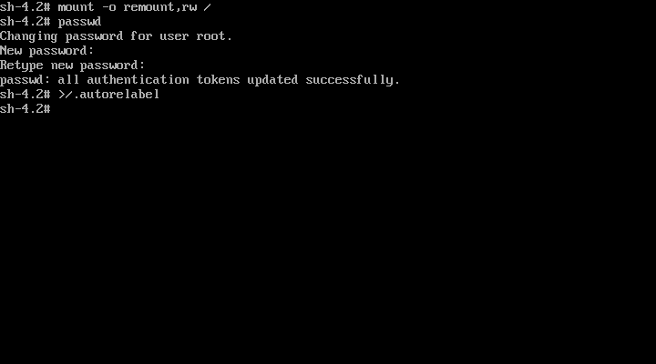
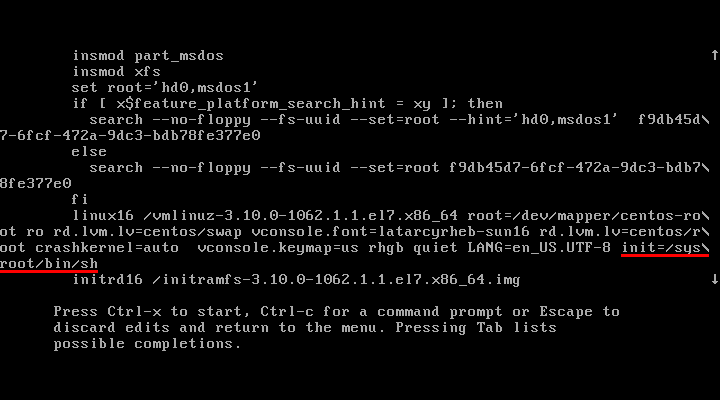
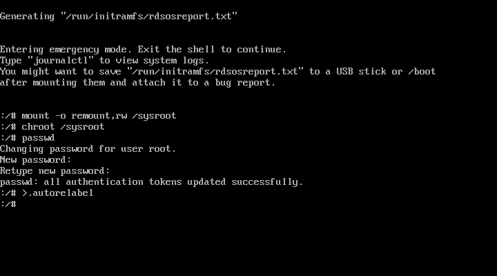
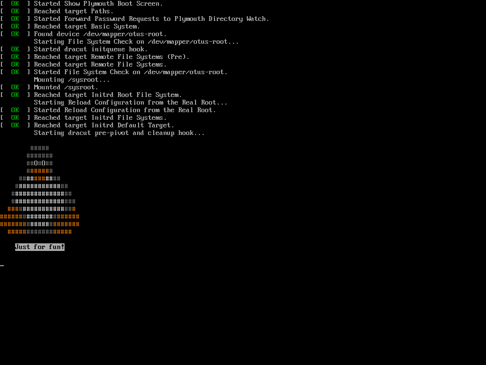

# Урок 07. "Загрузка системы"
## Домашнее задание
Зайти в систему без пароля рута - базовая задача сисадмина ( ну и одно из заданий на любой линуксовой сертификации). Так же нужно уметь управлять поведением загрузчика. Это и будем учиться делать в ДЗ
1. Попасть в систему без пароля несколькими способами
2. Установить систему с LVM, после чего переименовать VG
3. Добавить модуль в initrd
4. Сконфигурировать систему без отдельного раздела с /boot, а только с LVM

Репозиторий с пропатченым grub: https://yum.rumyantsev.com/centos/7/x86_64/
PV необходимо инициализировать с параметром --bootloaderareasize 1m

Критерии оценки:
Описать действия, описать разницу между методами получения шелла в процессе загрузки. Где получится - используем script, где не получается - словами или копипастой описываем действия.

## Результат

### Часть 1 ###

#### Получение доступа через rd.break ####
Получения доступа через rd.break заключается в обработке параметра самим initrd, который прерывает загрузку системы на раннем этапе и переходит в режим востановления.

После смены пароля выход из оболочки продолжает загрузку операционной системы.

| Конфигурация GRUB | Сброс пароля    |
| ------ | ------ |
|  |  |

#### Получение доступа через init=/bin/sh ####
Получение доступа через init=/bin/sh заключается в том, что в процессе загрузки вместо запуска основного процесса init выполняется запуск sh оболочки c "виртуального" root init ram disk.

| Конфигурация GRUB | Сброс пароля    |
| ------ | ------ |
|  |  |

#### Получение доступа через init=/sysroot/bin/sh ####
Получение доступа через init=/sysroot/bin/sh заключается в том, что в процессе загрузки вместо запуска основного процесса init выполняется запуск полноценной sh оболочки c оригинального root. По факту выполняется переход в режим восстановления идентичный rd.break.

После смены пароля выход из оболочки продолжает загрузку операционной системы.

| Конфигурация GRUB | Сброс пароля    |
| ------ | ------ |
|  |  |


### Часть 2 ###

В данной части выполняется переименование дисковой группы путем ansible provisioning.
Выполняются следующие действия:
- Переименовывается дисковая группа
- Вносятся изменения в конфигурационные файлы:
  - /etc/default/grub
  - /etc/grub2.cfg
  - /etc/fstab
- Пересобирается initrd
- Перезагружается сервер

Запуск стенда:
```bash
# vagrant up
```

После запуска стенда и его автоматической перезагрузки стенд готов.

Выполняем проверку что сервер загрузился.
```bash
# vagrant ssh
```

### Часть 3 ###
В данной части выполняется утсановка модуля dracut, который выводит tux'а на экран во время загрузки.

Запуск стенда:
```bash
# vagrant up
```
Пре перезагрузке виртуального сервера можно увидеть Tux'а.


### Часть 4 ###
В данной части выполняется перенос LVM с партиционированного диска на сырой.

Выполняются следующие действия:
- Копируются файлы из boot партиции
- Средствами pvmove переностятся данные на второй диск
- Подготавливается исходный диск (sda) соответствующим образом
- Средствами pvmove данные переносятся обратно
- Устанавливается GRUB
- Генерируется новый конфигурационный файл GRUB

Запуск стенда:
**Важно! Из-за использования механизма pvmove и объема root раздела в 40ГБ первичный запуск стенда с полным provision занимает ~40-50мин.**
```bash
# vagrant up
# vagrant reload
```

После перезагрузки виртуальный сервер будет загружен с LVM партиции.
```bash
# vagrant ssh
[vagrant@lesson-07-p4 ~]# lsblk
NAME                  MAJ:MIN RM  SIZE RO TYPE MOUNTPOINT
sda                     8:0    0   40G  0 disk
├─VolGroup00-LogVol00 253:0    0 37.5G  0 lvm  /
└─VolGroup00-LogVol01 253:1    0  1.5G  0 lvm  [SWAP]
sdb                     8:16   0   40G  0 disk
```
