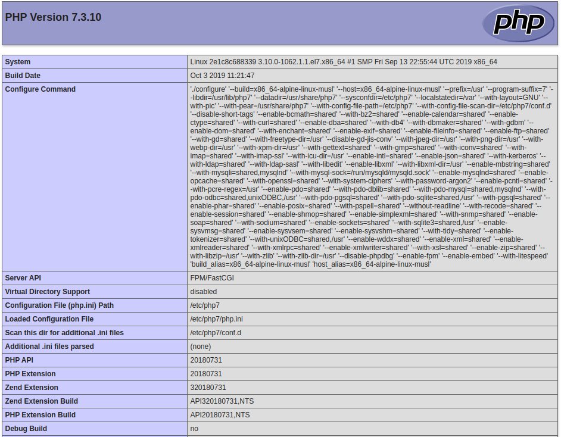

# Урок 15. "Docker"
## Домашнее задание
Создайте свой кастомный образ nginx на базе alpine. После запуска nginx должен
отдавать кастомную страницу (достаточно изменить дефолтную страницу nginx)

Определите разницу между контейнером и образом

Вывод опишите в домашнем задании.

Ответьте на вопрос: Можно ли в контейнере собрать ядро?

Собранный образ необходимо запушить в docker hub и дать ссылку на ваш
репозиторий.

## Результат

### Ответ 1 ###

Докер образ шаблон некоторого приложения, который является основой создания контейнера.

### Ответ 2 ###

Опираясь на поиски в интернете результат говорит что собрать ядро в докере возможно ([1](https://github.com/moul/docker-kernel-builder), [2](https://github.com/naftulikay/docker-ubuntu-kernel-build)). А исходя из опыта сборки rpm пакета на уроке №6 "Дистрибьюция софта" противопоказаний к сборке никаких нет.

**Вывод:** собрать ядро в докере возможно.

### Практическая часть ###

Результатом выполнения домашнего задания является готовые `docker-compose.yml` файл и `Dockerfile` для каждого из контейнеров (`web` и `php-fpm`).

Запуск стенда:
```bash
# docker-compose up -d
```

После запуска контейнеров можно просмотреть их статус, а также вывод информации `phpinfo()`.

```bash
# docker ps
CONTAINER ID        IMAGE                 COMMAND                  CREATED             STATUS              PORTS                NAMES
7949dd1c0cd8        otus-web:latest       "/usr/sbin/nginx"        6 minutes ago       Up 6 minutes        0.0.0.0:80->80/tcp   web
66fa4a7f5591        otus-php-fpm:latest   "/usr/sbin/php-fpm7 …"   6 minutes ago       Up 6 minutes        9000/tcp             php-fpm
```

```bash
# curl http://localhost
```


