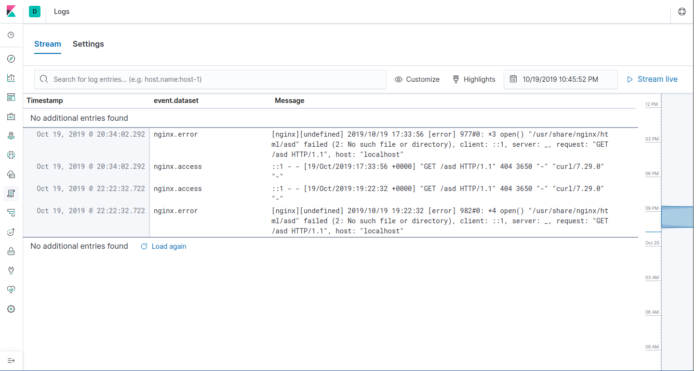

# Урок 16. "Сбор и анализ логов"
Настраиваем центральный сервер для сбора логов
в вагранте поднимаем 2 машины web и log

на web поднимаем nginx

на log настраиваем центральный лог сервер на любой системе на выбор
- journald
- rsyslog
- elk

настраиваем аудит следящий за изменением конфигов нжинкса
- все критичные логи с web должны собираться и локально и удаленно
- все логи с nginx должны уходить на удаленный сервер (локально только критичные)
- логи аудита должны также уходить на удаленную систему


(*) развернуть еще машину elk

настроить 2 центральных лог системы elk и какую либо еще

в elk должны уходить только логи нжинкса во вторую систему все остальное

Критерии оценки:
 - 4 - если присылают только логи скриншоты без вагранта
 - 5 - за полную настройку
 - 6 - если выполнено задание со звездочкой

# Результат

Результатом выполнения домашнего задания является Vagrantfile, который средствами ansible provisioning подготавливает следующий стенд:

- Создается веб-сервер `otus-web`, на котором устанавливается `nginx`, `filebeat`, `systemd-journal-upload`.
	-  Сервер средствами `systemd-journal-upload` отсылает все системные логи на сервер `otus-log`
	-  Сервер средствами `filebeat` при помощи модуля `nginx` отсылает все логи nginx на сервер `otus-elk`
- Создается лог-сервер `otus-log`, на котором разворачивается сервис сбора логов `systemd-jounal-remote`
- Создается лог-сервер `otus-elk`, на котором разворачивает стек ELK для сбора логов.

Запуск стенда:
```bash
# vagrant up
```

## Проверка логирования systemd-journal
Все действия выполняем на сервере `otus-log`

```bash
[root@otus-log ~]# ll /var/log/journal/remote/
total 8192
-rw-r-----. 1 systemd-journal-remote systemd-journal-remote 8388608 Oct 19 18:44 remote-::ffff:10.0.10.3.journal


[root@otus-log ~]# journalctl -efn -D /var/log/journal/remote/
-- Logs begin at Sat 2019-10-19 18:31:21 UTC. --
Oct 19 18:41:14 otus-web sshd[5964]: Disconnected from 10.0.2.2 port 35234
Oct 19 18:41:14 otus-web sshd[5961]: pam_unix(sshd:session): session closed for user vagrant
Oct 19 18:41:14 otus-web systemd-logind[2063]: Removed session 5.
:
:
```

## Проверка логирования в ELK
- В браузере открываем адрес [http://localhost:8080](http://localhost:8080)
- Переходим в раздел Logs
- На сервере `otus-web` выполняем
```bash
[root@otus-web ~]# curl http://localhost/asd
```
- В результате в ELK видим логи:


