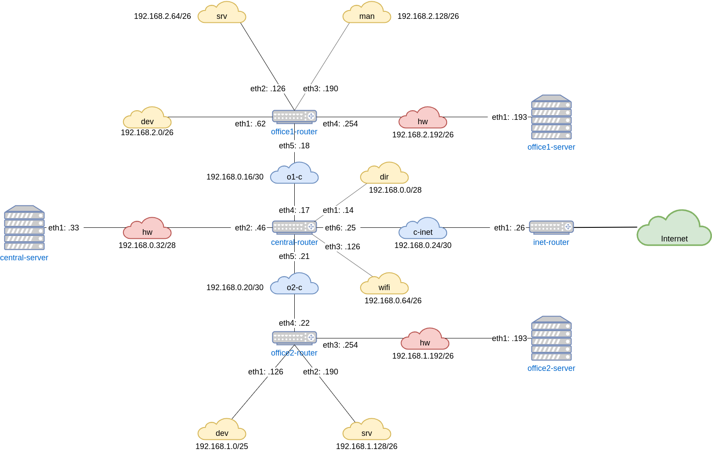

# Урок 18. "Архитектура сетей"
Разворачиваем сетевую лабораторию

### otus-linux

Vagrantfile - для стенда урока 9 - Network

### Дано
https://github.com/erlong15/otus-linux/tree/network
(ветка network)

Vagrantfile с начальным построением сети
- inetRouter
- centralRouter
- centralServer

тестировалось на virtualbox

### Планируемая архитектура
построить следующую архитектуру

Сеть office1
- 192.168.2.0/26 - dev
- 192.168.2.64/26 - test servers
- 192.168.2.128/26 - managers
- 192.168.2.192/26 - office hardware

Сеть office2
- 192.168.1.0/25 - dev
- 192.168.1.128/26 - test servers
- 192.168.1.192/26 - office hardware


Сеть central
- 192.168.0.0/28 - directors
- 192.168.0.32/28 - office hardware
- 192.168.0.64/26 - wifi

```
Office1 ---\
            -----> Central --IRouter --> internet
Office2----/
```
Итого должны получится следующие сервера
- inetRouter
- centralRouter
- office1Router
- office2Router
- centralServer
- office1Server
- office2Server

### Теоретическая часть
- Найти свободные подсети
- Посчитать сколько узлов в каждой подсети, включая свободные
- Указать broadcast адрес для каждой подсети
- проверить нет ли ошибок при разбиении

### Практическая часть
- Соединить офисы в сеть согласно схеме и настроить роутинг
- Все сервера и роутеры должны ходить в инет черз inetRouter
- Все сервера должны видеть друг друга
- у всех новых серверов отключить дефолт на нат (eth0), который вагрант поднимает для связи
- при нехватке сетевых интервейсов добавить по несколько адресов на интерфейс

### Критерии оценки
 - 4 - сделана хотя бы часть
 - 5 - все сделано

## Результат
### Теоретическая часть


- Найти свободные сети

Из выделенных диапазонов свободные подсети 192.168.0.16/28 и 192.168.0.128/25

- Посчитать сколько узлов в каждой подсети, включая свободные.
- Указать broadcast адрес для каждой сети

| Подсеть          | Broadcast     | Кол-во узлов | Назначение                    |
|------------------|---------------|--------------|-------------------------------|
| 192.168.2.0/26   | 192.168.2.63  | 62           | Office 1. dev                 |
| 192.168.2.64/26  | 192.168.2.127 | 62           | Office 1. test servers        |
| 192.168.2.128/26 | 192.168.2.191 | 62           | Office 1. managers            |
| 192.168.2.192/26 | 192.168.2.255 | 62           | Office 1. office hardware     |
| 192.168.1.0/25   | 192.168.1.127 | 126          | Office 2. dev                 |
| 192.168.1.128/26 | 192.168.1.191 | 62           | Office 2. test server         |
| 192.168.1.192/26 | 192.168.1.255 | 62           | Office 2. office hardware     |
| 192.168.0.0/28   | 192.168.0.15  | 14           | Central. directors            |
| 192.168.0.16/30  | 192.168.0.19  | 2            | Interlink. Office 1 - Central |
| 192.168.0.20/30  | 192.168.0.23  | 2            | Interlink. Office 2 - Central |
| 192.168.0.24/30  | 192.168.0.27  | 2            | Interlink. Inet - Central     |
| 192.168.0.32/28  | 192.168.0.63  | 14           | Central. office hardware      |
| 192.168.0.64/26  | 192.168.0.127 | 62           | Central. wifi                 |


### Практическая часть
Результатом выполнения домашнего задания является Vagrant стенд, в котором при помощи механизма ansible provisioning выполняется конфигурация серверов.

Запуск стенда
```bash
# vagrant up
```

На серверах, выполняющих функции роутеров выполнены следующие конфигурации:
- Включен форвардинг пакетов через sysctl
- Отключен маршрут по-умолчанию, который получают серверы от dhcp vagrnat'а

На следующем оборудовании сконфигурирован только маршрут по-умолчанию:
- office1-server
- office1-router
- office2-server
- office2-router
- central-server

На `central-router` сконфигурирован маршрут по-умолчанию в сторону `inet-router` и добавлены статические маршруты для подсетей Office1 и Office2.

На `inter-router` добавлены статические маршруты до сетей Office1, Office2 и Central, а также включен маскарадинг.

В результате конфигурации стенда все узлы сети могут достичь друг друга, а также имеют выход в Интернет через `inet-router`.