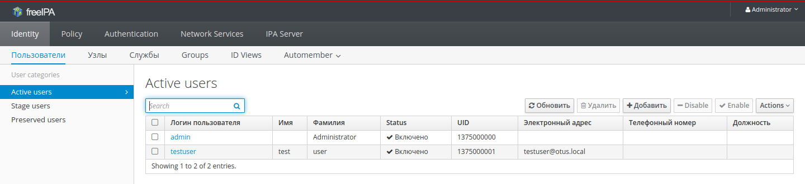
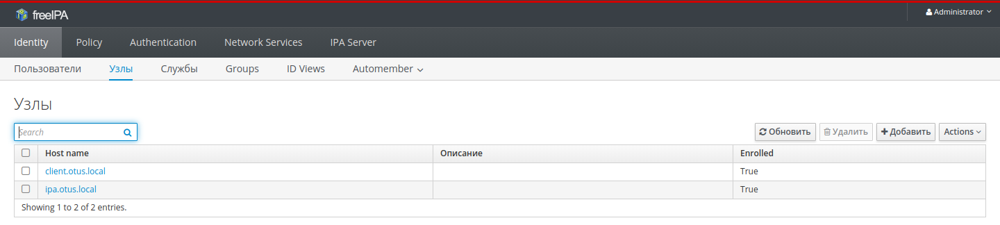

# Урок 19. "LDAP. Централизованная авторизация и аутентификация."
## Домашнее задание

LDAP

1. Установить FreeIPA
2. Написать playbook для конфигурации клиента
3. [*]Настроить авторизацию по ssh-ключам

В git - результирующий playbook

## Результат

Результатом выполнения домашнего задания является Vagranfile, который средствами ansible provisioning подготавливает следующий стенд.
- Сервер `ipa.otus.local` с развернутой инфраструктурой `Free IPA`.
- Клиент `client.otus.local`, заведен как узел в `Free IPA`.
- Создан тестовый пользователь `testuser` во `Free IPA`, который может авторизоваться по ключам на хосте.

**Внимание!** Стенд стребователен к ресурсам (памяти). Требуется не менее 2ГБ для одновременного запуска виртуальных машин.

**Запуск стенда:**

```bash
# vagrant up ipa.otus.local

# vagrant up client.otus.local
```

### Проверка работоспособности Free IPA ###
На хостовой системе добавить в `/etc/hosts` строку
```
127.0.0.1    ipa.otus.local
```

Перейти в браузере по [https://ipa.otus.local:8443](https://ipa.otus.local:8443) и авторизоваться под пользователем `admin`/`adminpassword`.



### Проверка регистрации клиента###
Перейти в панели администрирования `Free IPA` по следующему пути `Identity` -> `Узлы`.



### Проверка авторизации по ssh ключу ###
На хостовой системе выполнить:
```bash
# ssh -i testuser.priv.key testuser@localhost -p 22522
[testuser@client ~]$
[testuser@client ~]$ hostname
client.otus.local
```
