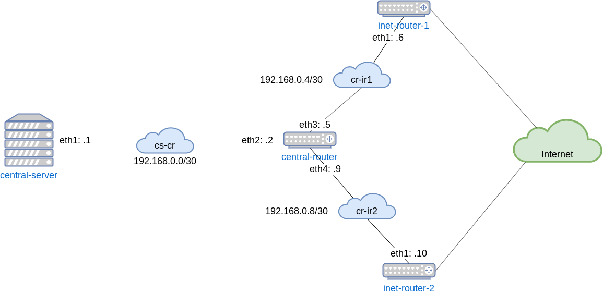

# Урок 20. "Фильтрация трафика"
## Домашнее задание
Сценарии iptables

1. реализовать knocking port
	- centralRouter может попасть на ssh inetrRouter через knock скрипт пример в материалах
2. добавить inetRouter2, который виден(маршрутизируется) с хоста
3. запустить nginx на centralServer
4. пробросить 80й порт на inetRouter2 8080
5. дефолт в инет оставить через inetRouter

**Критерии оценки:**
5 - все сделано

## Результат
Результатом выполнения домашнего задания является Vagrant файл, который средствами ansible provisioning подготавливает следующий стенд:
- сервер `inet-router-1` на котором установлен knock-server и через который осуществляется выход в интернет сервера `central-server`
- сервер `inet-router-2` на котором настроен проброс порта 8080 до сервера `central-server` на порт 80
- сервер `central-router` на котором установлен knock для доступа по протоколу `ssh` до сервера `inet-router-1`
- сервер `central-server` на котором установлен сервис `nginx`



**Запуск стенда:**
```bash
# vagrant up
```

### Проверка knock сервиса
Зайти на сервер `central-router` и проверить что сервер `inet-router-1` не доступен по `ssh`
```bash
# vagrant ssh central-router
[vagrant@central-router ~]$ ssh test@192.168.0.6
ssh: connect to host 192.168.0.6 port 22: Connection refused
```

Пробуем "постучаться" на сервер и зайти на него по `ssh` пользователем `test` пароль `otustest`
```bash
[vagrant@central-router ~]$ knock 192.168.0.6 2222:udp 3333:tcp 4444:udp
[vagrant@central-router ~]$ ssh test@192.168.0.6
[test@inet-router-1 ~]$
```

### Проверка проброса порта
С хостовой системы выполняем команду
```bash
$ curl http://localhost:8080
OTUS central server
```


### Проверка маршрутизации
На хосте `central-server` выполним команду
```bash
[vagrant@central-server ~]$ mtr 8.8.8.8
                                                                            Packets               Pings
 Host                                                                      Loss%   Snt   Last   Avg  Best  Wrst StDev
 1. 192.168.0.2                                                             0.0%    13    6.4   5.1   4.0   7.9   0.9
 2. 192.168.0.6                                                             0.0%    13    8.0   8.6   6.7  11.3   1.2
 3. ???
 4. ???
 5. ???
 6. 138.197.244.44                                                          0.0%    12   10.2  11.4   9.6  16.9   1.9
 7. 162.243.191.243                                                         0.0%    12    9.6  24.2   9.2 161.0  43.2
 8. 108.170.248.33                                                          0.0%    12   12.6  13.2  10.4  18.8   2.3
 9. 216.239.62.149                                                          0.0%    12   10.4  12.8  10.1  18.3   2.9
10. dns.google                                                              0.0%    12   12.5  14.0  10.2  27.4   4.6
```
Как видно из вывода трафик идет через `inet-router-1`.