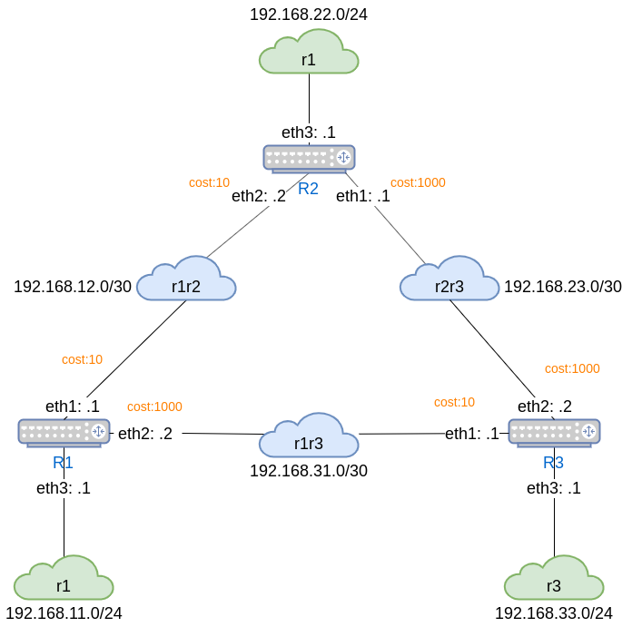

# Урок 21. "Статическая и динамическая маршрутизация"
## Домашнее задание
OSPF
- Поднять три виртуалки
- Объединить их разными private network
	1. Поднять OSPF между машинами на базе Quagga
	2. Изобразить ассиметричный роутинг
	3. Сделать один из линков "дорогим", но что бы при этом роутинг был симметричным

Формат сдачи:
Vagrantfile + ansible

## Результат
Результатом выполнения домашнего задания является Vagrant файл, который средствами ansible provisioning подготавливает следующий стенд:



Запуск стенда:
```bash
# vagrant up
```

### Проверка OSPF
На узле `r1` выполним следующие команды:
```bash
# vagrant ssh r1

[vagrant@r1 ~]$ sudo vtysh

r1# sh ip ospf neighbor

    Neighbor ID Pri State           Dead Time Address         Interface            RXmtL RqstL DBsmL
127.0.0.2         1 Full/Backup       34.149s 192.168.12.2    eth1:192.168.12.1        0     0     0
127.0.0.3         1 Full/Backup       30.118s 192.168.31.1    eth2:192.168.31.2        0     0     0

r1# sh ip route
Codes: K - kernel route, C - connected, S - static, R - RIP,
       O - OSPF, I - IS-IS, B - BGP, A - Babel,
       > - selected route, * - FIB route

K>* 0.0.0.0/0 via 10.0.2.2, eth0
O   10.0.2.0/24 [110/20] via 192.168.12.2, eth1, 00:11:06
C>* 10.0.2.0/24 is directly connected, eth0
C>* 127.0.0.0/8 is directly connected, lo
C>* 192.168.11.0/24 is directly connected, eth3
O   192.168.12.0/30 [110/10] is directly connected, eth1, 00:14:37
C>* 192.168.12.0/30 is directly connected, eth1
O>* 192.168.22.0/24 [110/20] via 192.168.12.2, eth1, 00:11:06
O>* 192.168.23.0/30 [110/1010] via 192.168.12.2, eth1, 00:11:07
O   192.168.31.0/30 [110/1000] is directly connected, eth2, 00:14:37
C>* 192.168.31.0/30 is directly connected, eth2
O>* 192.168.33.0/24 [110/20] via 192.168.31.1, eth2, 00:07:46
```
Из вывода команд видим, что соседство по протоколу OSPF установлено со всеми узлами сети. Подсети между узлами анонсируются.


### Проверка ассиметричного трафика
На узле `r1` выполним трассировку.
```bash
# vagrant ssh r1

[vagrant@r1 ~]$ tracepath 192.168.23.2
 1?: [LOCALHOST]                                         pmtu 1500
 1:  192.168.12.2                                         15.729ms
 1:  192.168.12.2                                          8.664ms
 2:  192.168.23.2                                          6.698ms reached
     Resume: pmtu 1500 hops 2 back 1
```
Из вывода команды видим, что пакеты преодолевают в прямом направлении 2 hop'а, а в обратном - 1. Т.е. пакет от `r1` в прямом направлении идет по маршруту `r1-r2-r3`, а в обратном `r3-r1`.


### Проверка дорого линка с симетричным трафиком
На узле `r3` выполним трассировку.
```bash
# vagrant ssh r3

[vagrant@r3 ~]$ tracepath 192.168.12.2
 1?: [LOCALHOST]                                         pmtu 1500
 1:  192.168.31.2                                          7.901ms
 1:  192.168.31.2                                          3.438ms
 2:  192.168.12.2                                          9.732ms reached
     Resume: pmtu 1500 hops 2 back 2
```
Из вывода команды видим, что пакеты преодолевают в прямом и обратном направлениях 2 hop'а. Т.е. пакет от `r3` в прямом направлении идет по мартшруту `r3-r1-r2` и в обратном направлении `r2-r1-r3`.