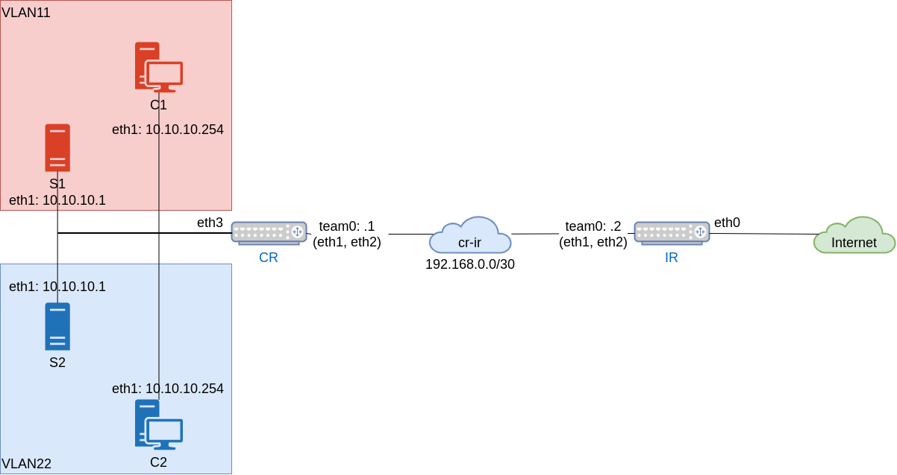
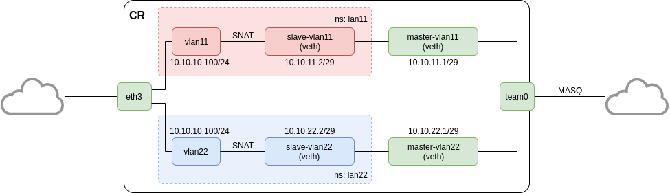

# Урок 24. "Сетевые пакеты. VLAN'ы. LACP"
## Домашнее задание

В Office1 в тестовой подсети появляется сервер с доп. интерфесами и адресами в internal сети testLAN:
- testClient1 - 10.10.10.254
- testClient2 - 10.10.10.254
- testServer1 - 10.10.10.1
- testServer2 - 10.10.10.1

Изолировать с помощью vlan:
- testClient1 <-> testServer1
- testClient2 <-> testServer2

Между centralRouter и inetRouter создать 2 линка (общая inernal сеть) и объединить их с помощью bond-интерфейса,
проверить работу c отключением сетевых интерфейсов

Результат ДЗ:
- vagrant файл с требуемой конфигурацией
- Конфигурация должна разворачиваться с помощью ansible
- (*) реализовать teaming вместо bonding'а (проверить работу в active-active)
- (**) реализовать работу интернета с test машин


## Результат
Результатом выполнения домашнего задания является Vagrant файл, который средствами ansible provisioning подготавливает следующий стенд:
- Интернет роутер `ir` (192.168.0.2/30)
- Центральный роутер `cr` (192.168.0.1/30, 10.10.10.100/24)
- Клиент `c1` (10.10.10.254/24)
- Клиент `c2` (10.10.10.254/24)
- Сервер `s1` (10.10.10.1/24)
- Сервер `s2` (10.10.10.1/24)



**Запуск стенда:**
```bash
# vagrant up
```

### Проверка работы team интерфесов между `ir` и `cr`
В VirtualBox из-за особенностей работы виртуальных сетей не удалось реализовать teaming в режиме `loadbalance`, хотя аналогичная конфигурация работает в виртуальной машине KVM.

Для режима `activebackup` была использована информация с сайта RedHat [https://access.redhat.com/solutions/2104811](https://access.redhat.com/solutions/2104811).

```bash
[root@ir ~]# teamdctl team0 state
setup:
  runner: activebackup
ports:
  eth1
    link watches:
      link summary: up
      instance[link_watch_0]:
        name: ethtool
        link: up
        down count: 0
  eth2
    link watches:
      link summary: up
      instance[link_watch_0]:
        name: ethtool
        link: up
        down count: 0


[root@cr ~]# teamdctl team0 state
setup:
  runner: activebackup
ports:
  eth1
    link watches:
      link summary: up
      instance[link_watch_0]:
        name: ethtool
        link: up
        down count: 0
  eth2
    link watches:
      link summary: up
      instance[link_watch_0]:
        name: ethtool
        link: up
        down count: 0
```
Как видно из вывода team0 интерфесы работают с обоих концов.

Отключаем на `cr` поочередно интерфейсы `eth1` и `eth2` и проверяем работу team интерфейсов.
```bash
[root@cr ~]# ip l set eth1 down

[root@ir network-scripts]# ping 192.168.0.1
PING 192.168.0.1 (192.168.0.1) 56(84) bytes of data.
64 bytes from 192.168.0.1: icmp_seq=1 ttl=64 time=5.97 ms
64 bytes from 192.168.0.1: icmp_seq=2 ttl=64 time=8.92 ms

[root@cr ~]# ip l set eth1 up
[root@cr ~]# ip l set eth2 down

[root@ir network-scripts]# ping 192.168.0.1
PING 192.168.0.1 (192.168.0.1) 56(84) bytes of data.
64 bytes from 192.168.0.1: icmp_seq=1 ttl=64 time=5.52 ms
64 bytes from 192.168.0.1: icmp_seq=2 ttl=64 time=4.03 ms
```

### Проверка работы интернета с машин `c1` и `c2`
Для организации доступа с тестовых машин, на сервере `cr` были использованы `namespace` для объединения двух vlan.

Namespace создаются и удаляются созданным сервисом `otus-lan` на `cr`.



```bash
[root@c1 ~]# ping 8.8.8.8
PING 8.8.8.8 (8.8.8.8) 56(84) bytes of data.
64 bytes from 8.8.8.8: icmp_seq=1 ttl=57 time=14.0 ms

[root@c1 ~]# tracepath -nn 8.8.8.8
 1?: [LOCALHOST]                   pmtu 1500
 1:  10.10.10.100                  7.174ms
 1:  10.10.10.100                  6.183ms
 2:  10.10.11.1                    6.187ms
 3:  192.168.0.2                   9.763ms
 :
 :

[root@c2 ~]# ping 8.8.8.8
PING 8.8.8.8 (8.8.8.8) 56(84) bytes of data.
64 bytes from 8.8.8.8: icmp_seq=1 ttl=57 time=14.3 ms

[root@c2 ~]# tracepath -nn 8.8.8.8
 1?: [LOCALHOST]                   pmtu 1500
 1:  10.10.10.100                  7.174ms
 1:  10.10.10.100                  6.573ms
 2:  10.10.22.1                    6.931ms
 3:  192.168.0.2                   15.530ms
 :
 :
```