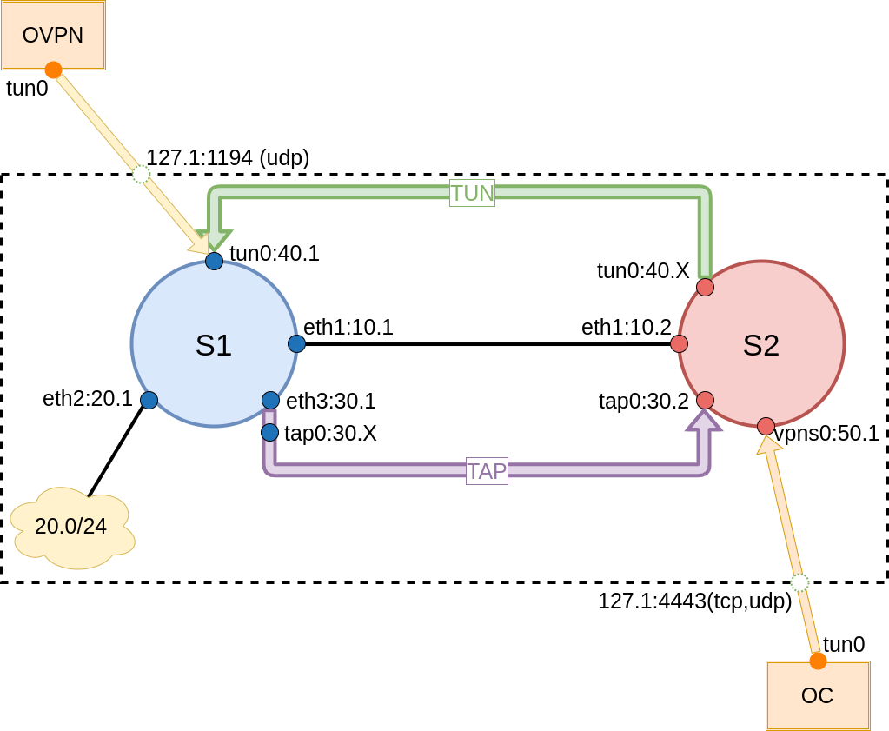

# Урок 25. "Мосты, туннели и VPN"
## Домашнее задание

- Между двумя виртуалками поднять vpn в режимах
	- tun
	- tap
Прочуствовать разницу.

- Поднять RAS на базе OpenVPN с клиентскими сертификатами, подключиться с локальной машины на виртуалку

- (*) Самостоятельно изучить, поднять ocserv и подключиться с хоста к виртуалке

## Результат

Результатом выполнения домашнего задания является Vagrant файл, который средствами ansible provisioning подготавливают стенд.



**Запуск стенда**
```bash
# vagrant up
```

### Проверка работы TUN
```bash
# vagrant ssh s2
[vagrant@s2 ~]$ ping 10.10.40.1
PING 10.10.40.1 (10.10.40.1) 56(84) bytes of data.
64 bytes from 10.10.40.1: icmp_seq=1 ttl=64 time=4.52 ms

[vagrant@s2 ~]$ ping 10.10.20.1
PING 10.10.20.1 (10.10.20.1) 56(84) bytes of data.
64 bytes from 10.10.20.1: icmp_seq=1 ttl=64 time=5.46 ms
```

### Проверка работы TAP
```bash
# vagrant ssh s1
[root@s1 ~]# ping 10.10.30.2
PING 10.10.30.2 (10.10.30.2) 56(84) bytes of data.
64 bytes from 10.10.30.2: icmp_seq=1 ttl=64 time=3.73 ms
```

Основным отличием работы TAP от TUN в том, что TAP объединяет на уровне L2, TUN - L3.

### Проверка работы RAS OpenVPN
На хостовой системе выполняем следующие команды:
```bash
# openvpn client.ovpn
# ping 10.10.40.1
PING 10.10.40.1 (10.10.40.1) 56(84) bytes of data.
64 bytes from 10.10.40.1: icmp_seq=1 ttl=64 time=3.16 ms

# ping 10.10.20.1
PING 10.10.20.1 (10.10.20.1) 56(84) bytes of data.
64 bytes from 10.10.20.1: icmp_seq=1 ttl=64 time=3.68 ms
```

### Проерка работы RAS OCServ
На хостовой системе выполняем следующие команды (авторизация проходит под пользователем `otus-vpn` с паролем `otus-vpn`):
```bash
# openconnect 127.1:4443 --config=openconnect.conf
POST https://127.1:4443/
Connected to 127.0.0.1:4443
SSL negotiation with 127.1
Server certificate verify failed: signer not found
Connected to HTTPS on 127.1
XML POST enabled
Please enter your username.
POST https://127.1:4443/auth
Please enter your password.
Password:
POST https://127.1:4443/auth
Got CONNECT response: HTTP/1.1 200 CONNECTED
CSTP connected. DPD 90, Keepalive 32400
Set up DTLS failed; using SSL instead
Connected as 10.10.50.6, using SSL

# ping 10.10.50.1
PING 10.10.50.1 (10.10.50.1) 56(84) bytes of data.
64 bytes from 10.10.50.1: icmp_seq=1 ttl=64 time=3.45 ms

# ping 10.10.20.1
PING 10.10.20.1 (10.10.20.1) 56(84) bytes of data.
64 bytes from 10.10.20.1: icmp_seq=1 ttl=63 time=10.7 ms
```
