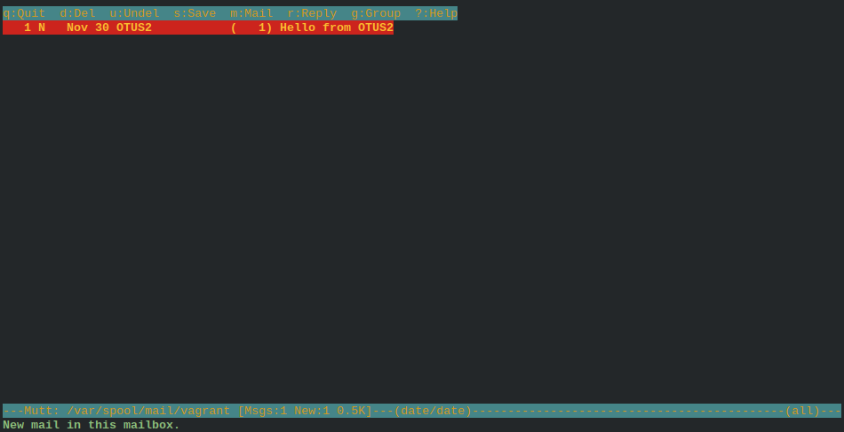
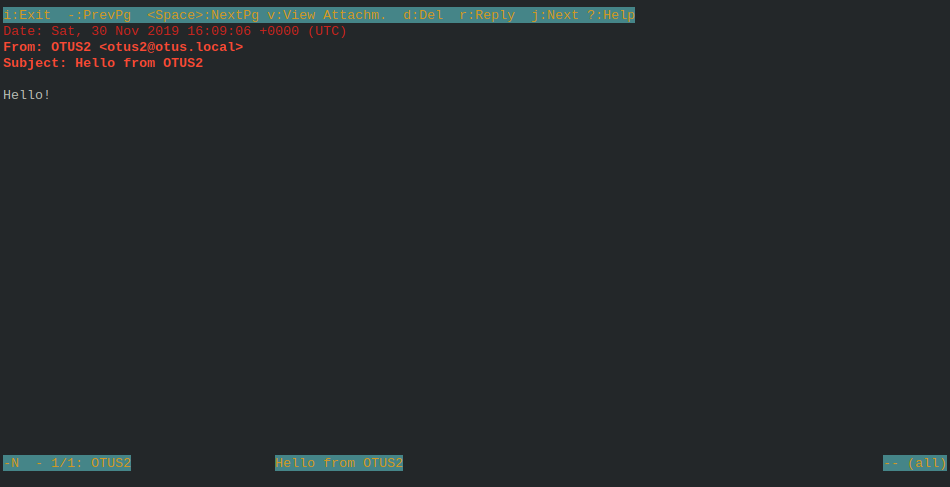

# Урок 27. "Почта: SMTP, IMAP, POP3"
## Домашнее задание

Установка почтового сервера
- Установить в виртуалке postfix+dovecot для приёма почты на виртуальный домен любым обсужденным на семинаре способом
- Отправить почту телнетом с хоста на виртуалку
- Принять почту на хост почтовым клиентом

Результат
- Полученное письмо со всеми заголовками
- Конфиги postfix и dovecot

## Результат

Результатом выполнения домашнего задания является Vagrant файл, который средствами ansible provisioning подготавливает следующий стенд:
- Сервер `mail` с установлеными `postfix` и `dovecot`
- Сервер клиент `mail-client` с установленными `telnet` и почтовым клиентом `mutt`

**Запуск стенда**
```bash
# vagrant up
```

### Отправка почты при помощи telnet
На сервере клиенте `mail-client` выполняем следующие дествия:
```bash
# vagrant ssh mail-client

[vagrant@mail-client ~]$ telnet 10.10.10.1 25
Trying 10.10.10.1...
Connected to 10.10.10.1.
Escape character is '^]'.
220 "Welcome to OTUS mail server"
helo mail-client
250 mail.otus.local
mail from:otus2@otus.local
250 2.1.0 Ok
rcpt to:otus1@otus.local
250 2.1.5 Ok
data
354 End data with <CR><LF>.<CR><LF>
From: OTUS2 <otus2@otus.local>
Subject: Hello from OTUS2

Hello!
.
250 2.0.0 Ok: queued as A837B8C13A
quit
221 2.0.0 Bye
Connection closed by foreign host.
```

На сервере `mail` проверяем что письмо дошло до пользователя `otus1`
```bash
# vagrant ssh mail

[vagrant@mail mail]$ ll /var/spool/mail/otus1 
-rw-------. 1 otus1 mail 476 Nov 30 16:09 /var/spool/mail/otus1

[vagrant@mail mail]$ sudo cat /var/spool/mail/otus1 
From otus2@otus.local  Sat Nov 30 16:09:33 2019
Return-Path: <otus2@otus.local>
X-Original-To: otus1@otus.local
Delivered-To: otus1@otus.local
Received: from mail-client (unknown [10.10.10.2])
        by mail.otus.local (Postfix) with SMTP id F17928C13A
        for <otus1@otus.local>; Sat, 30 Nov 2019 16:09:06 +0000 (UTC)
From: OTUS2 <otus2@otus.local>
Subject: Hello from OTUS2
Message-Id: <20191130160914.F17928C13A@mail.otus.local>
Date: Sat, 30 Nov 2019 16:09:06 +0000 (UTC)

Hello!

```

### Проверка работы с почтовым клиентом
Проверяе работу сервера при помощи почтового клиента `mutt`

На сервере клиенте `mail-client` запускаем предварительно (ansible provisioning) сконфигурированный почтовый клиент `mutt`
```bash
[vagrant@mail-client ~]$ mutt
```
Нажимаем комбинацию клавиш `Shift + g` для получения почты.


Выбираем сообщение и нажимаем клавишу `Enter`


Как видно из снимков экрана выше, письмо было доставлено от пользователя `otus2` пользователю `otus1`.
