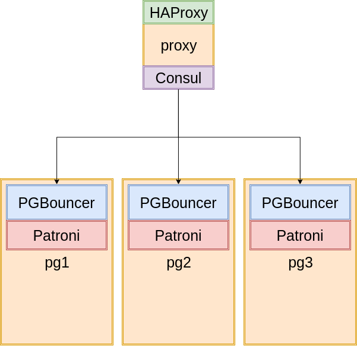
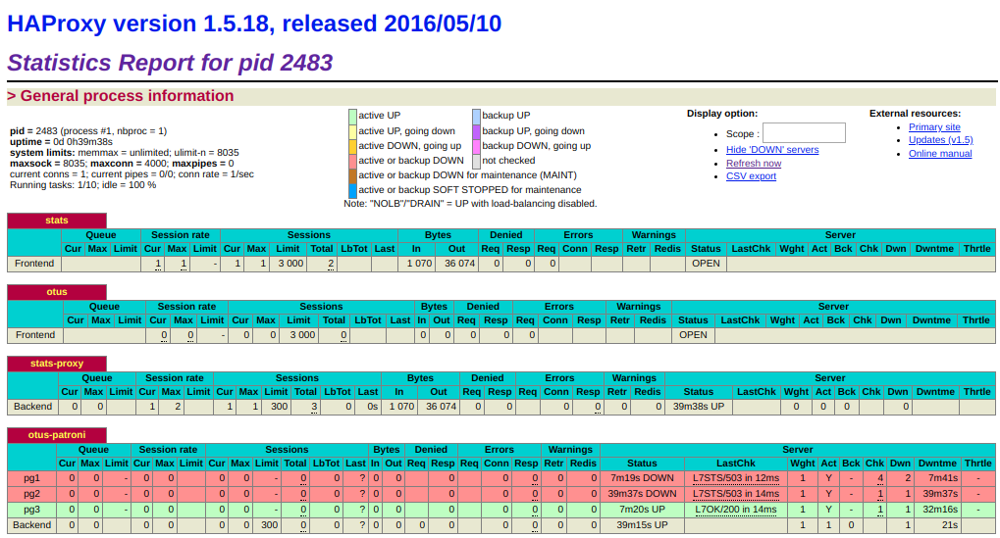

# Урок 31. "PostgreSQL cluster"
## Домашнее задание
Кластер PostgreSQL на Patroni

Развернуть кластер PostgreSQL из трех нод. Создать тестовую базу - проверить статус репликации

Сделать switchover/failover

Поменять конфигурацию PostgreSQL + с параметром требующим перезагрузки

(*) Настроить клиентские подключения через HAProxy

(**) Настроить пулер соединений на базе pgbouncer либо pgpool

Все результаты приложить описанием в MD либо скриншотами. Можно совместить.

## Результат
Результатом выполнения домашнего задания является Vagrant файл, который средствами ansible provisioning подготавливает следующий стенд:
- Сервер `proxy` с установленными `HAProxy` и `Consul`
- Сервер `pg1` с установленным `PostgreSQL`, `Patroni` и `PGBouncer`
- Сервер `pg2` с установленным `PostgreSQL`, `Patroni` и `PGBouncer`
- Сервер `pg3` с установленным `PostgreSQL`, `Patroni` и `PGBouncer`



**Запуск стенда**
```bash
# vagrant up
```

### Проверка работы Patroni
- Заходим на сервер `pg1` и проверяем состояние кластера

```bash
$ vagrant ssh pg1
[vagrant@pg1 ~]$ sudo -i

root@pg1 ~]# patronictl -c /etc/patroni.yml list
+---------+--------+------------+--------+---------+----+-----------+
| Cluster | Member |    Host    |  Role  |  State  | TL | Lag in MB |
+---------+--------+------------+--------+---------+----+-----------+
|   otus  |  pg1   | 10.10.10.2 | Leader | running |  3 |           |
|   otus  |  pg2   | 10.10.10.3 |        | running |  3 |       0.0 |
|   otus  |  pg3   | 10.10.10.4 |        | running |  3 |       0.0 |
+---------+--------+------------+--------+---------+----+-----------+
```

- Переводим `Leader` на `pg3`

```bash
[root@pg1 ~]# patronictl -c /etc/patroni.yml switchover
Master [pg1]:
Candidate ['pg2', 'pg3'] []: pg3
When should the switchover take place (e.g. 2019-12-26T19:58 )  [now]:
Current cluster topology
+---------+--------+------------+--------+---------+----+-----------+
| Cluster | Member |    Host    |  Role  |  State  | TL | Lag in MB |
+---------+--------+------------+--------+---------+----+-----------+
|   otus  |  pg1   | 10.10.10.2 | Leader | running |  3 |           |
|   otus  |  pg2   | 10.10.10.3 |        | running |  3 |       0.0 |
|   otus  |  pg3   | 10.10.10.4 |        | running |  3 |       0.0 |
+---------+--------+------------+--------+---------+----+-----------+
Are you sure you want to switchover cluster otus, demoting current master pg1? [y/N]: y
2019-12-26 18:58:16.18367 Successfully switched over to "pg3"
+---------+--------+------------+--------+---------+----+-----------+
| Cluster | Member |    Host    |  Role  |  State  | TL | Lag in MB |
+---------+--------+------------+--------+---------+----+-----------+
|   otus  |  pg1   | 10.10.10.2 |        | stopped |    |   unknown |
|   otus  |  pg2   | 10.10.10.3 |        | running |  3 |       0.0 |
|   otus  |  pg3   | 10.10.10.4 | Leader | running |  3 |           |
+---------+--------+------------+--------+---------+----+-----------+


[root@pg1 ~]# patronictl -c /etc/patroni.yml list
+---------+--------+------------+--------+---------+----+-----------+
| Cluster | Member |    Host    |  Role  |  State  | TL | Lag in MB |
+---------+--------+------------+--------+---------+----+-----------+
|   otus  |  pg1   | 10.10.10.2 |        | running |  4 |       0.0 |
|   otus  |  pg2   | 10.10.10.3 |        | running |  4 |       0.0 |
|   otus  |  pg3   | 10.10.10.4 | Leader | running |  4 |           |
+---------+--------+------------+--------+---------+----+-----------+
```


### Проверка работы PGBouncer
Т.к. в текущий момент `Leader` располагается на `pg3`, то на сервере `pg1`выполним соединение к серверу `pg3` через `pgbouncer`

```bash
[root@pg1 ~]# psql -h 10.10.10.4 -p 6432 -U postgres
Password for user postgres:
psql (12.1)
Type "help" for help.

postgres=# \l
                                  List of databases
   Name    |  Owner   | Encoding |   Collate   |    Ctype    |   Access privileges
-----------+----------+----------+-------------+-------------+-----------------------
 postgres  | postgres | UTF8     | en_US.UTF-8 | en_US.UTF-8 |
 template0 | postgres | UTF8     | en_US.UTF-8 | en_US.UTF-8 | =c/postgres          +
           |          |          |             |             | postgres=CTc/postgres
 template1 | postgres | UTF8     | en_US.UTF-8 | en_US.UTF-8 | =c/postgres          +
           |          |          |             |             | postgres=CTc/postgres
(3 rows)
```


### Проверка работы HAProxy
C хост системы в браузере открываем ссылку [http://localhost:8080](http://localhost:8080) и авторизуемся с логином `admin` и паролем `adminotus`.


С сервера `pg1` через `proxy` соединяемся с БД

```bash
[root@pg1 ~]# psql -h 10.10.10.1 -p 5432 -U postgres
Password for user postgres:
psql (12.1)
Type "help" for help.

postgres=# \l
                                  List of databases
   Name    |  Owner   | Encoding |   Collate   |    Ctype    |   Access privileges
-----------+----------+----------+-------------+-------------+-----------------------
 postgres  | postgres | UTF8     | en_US.UTF-8 | en_US.UTF-8 |
 template0 | postgres | UTF8     | en_US.UTF-8 | en_US.UTF-8 | =c/postgres          +
           |          |          |             |             | postgres=CTc/postgres
 template1 | postgres | UTF8     | en_US.UTF-8 | en_US.UTF-8 | =c/postgres          +
           |          |          |             |             | postgres=CTc/postgres
(3 rows)
```