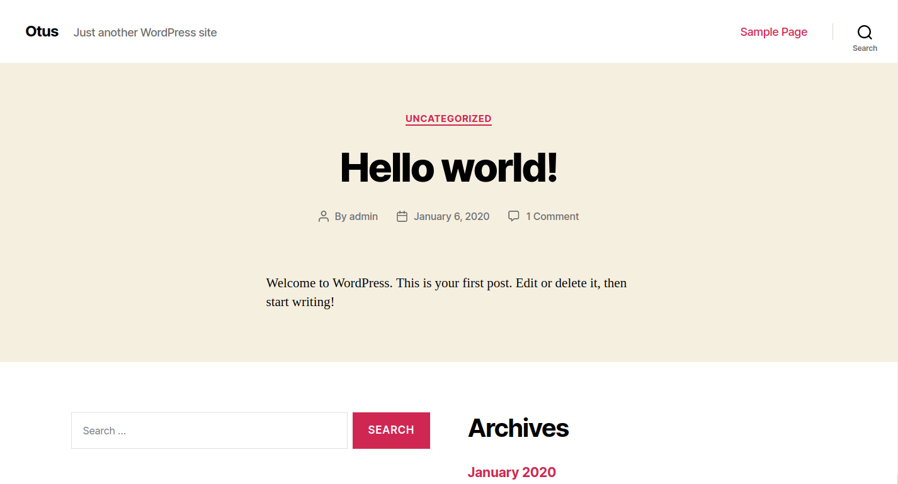
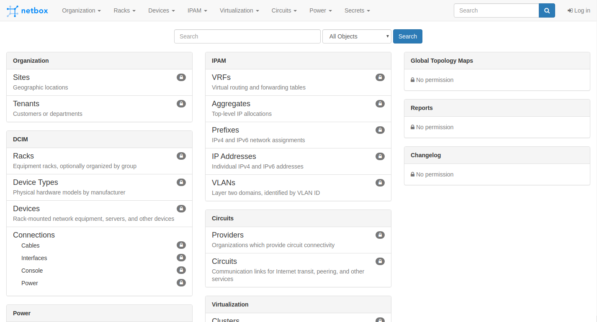
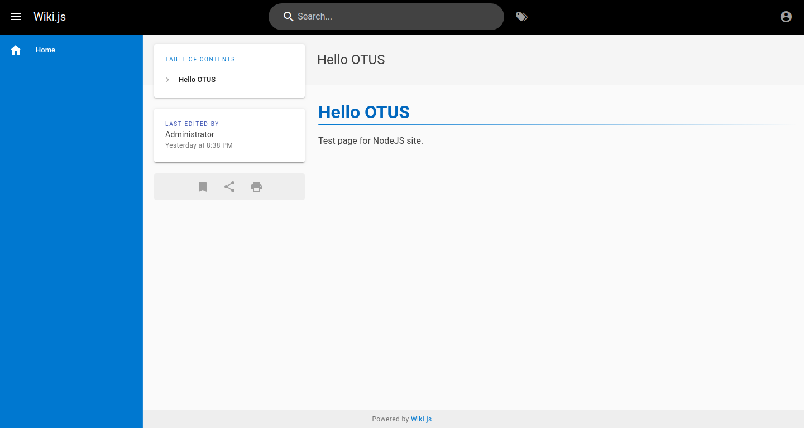

# Урок 33. "Динамический веб контент"
## Домашнее задание
Собрать стенд с 3мя проектами на выбор
Варианты стенда
nginx + php-fpm (laravel/wordpress) + python (flask/django) + js(react/angular)
nginx + java (tomcat/jetty/netty) + go + ruby
можно свои комбинации

Реализации на выбор
- на хостовой системе через конфиги в /etc
- деплой через docker-compose

Для усложнения можно попросить проекты у коллег с курсов по разработке

К сдаче примается vagrant стэнд с проброшенными на локалхост портами каждый порт на свой сайт через нжинкс

## Результат
Результатом выполнения домашнего задания является Vagrant файл, который средствами ansible provisioning подготавливает сервер с сайтами:
- Сайт A (nginx + php-fpm, [Wordpress](https://wordpress.org/))
- Сайт B (nginx + python, [Netbox](https://netbox.readthedocs.io/))
- Сайт C (nginx + NodeJS, [WikiJS](https://wiki.js.org/))

**Запуск стенда**
```bash
# vagrant up
```

### Проверка сайта A (nginx + php-fpm)
На хост системе в браузере открыть [http://localhost:10001](http://localhost:10001)


**Панель администрирования**

Адрес: http://localhost:10001/wp-login.php

Логин: admin

Пароль: otus


### Проверка сайта B (nginx + python)
На хост системе в браузере открыть [http://localhost:10002](http://localhost:10002)



### Проверка сайта C (nginx + NodeJS)
На хост системе в браузере открыть [http://localhost:10003](http://localhost:10003)


**Панель администрирования**

Адрес: http://localhost:10003/login

Логин: admin@otus.local

Пароль: adminotus
